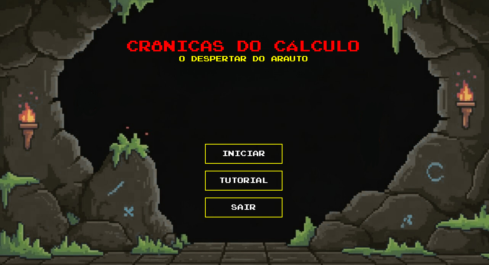

# CRÔNICAS DO CÁLCULO: O DESPERTAR DO ARAUTO 🎮📚

## Índice
- [Descrição](#descrição)
- [História do Jogo](#história-do-jogo)
- [Funcionalidades](#funcionalidades)
- [Tecnologias Usadas](#tecnologias-usadas)
- [Como Jogar](#como-jogar)
- [Referências](#referências)
- [Contato](#contato)

## Descrição
Este é um jogo 2D educativo desenvolvido em C com a biblioteca Allegro. O jogo une exploração, batalhas por turnos inspiradas no Dungeon Dragons e resolução de enigmas matemáticos para criar uma experiência imersiva. O jogador enfrenta bosses que são figuras mitológicas encarnando grandes matemáticos da história e entidade suprema arauto da matemática, desafiando raciocínio lógico e estratégia.

## História do Jogo
Você é um estudante muito curioso, sempre em busca de conhecimento. Ao ouvir falar de um lugar misterioso onde seria possível aprender todos os segredos da matemática, decide procurá-lo. Rapidamente descobre que esse local é protegido por uma entidade enigmática conhecida como Arauto da Matemática. Aqueles que entram em seu domínio precisam superar desafios rigorosos, provar seu valor e demonstrar que são dignos de obter todo o conhecimento matemático. Caso não consigam, o destino é a própria morte.

Para alcançar esse saber supremo, além de resolver enigmas e superar obstáculos, é necessário derrotar os mestres matemáticos, que servem como braço direito do Arauto, figuras lendárias como o Minotauro de Arquimedes e a Medusa de Hipátia. Cada mestre representa grandes matemáticos da história, que foram incorporados em figuras mitológicas pelo próprio Arauto. Só após vencer todos esses desafios, será possível enfrentar finalmente a entidade soberana, o Arauto da Matemática, e assim conquistar o conhecimento absoluto.

Uma dica valiosa, jovem estudante: o território do Arauto é repleto de mistérios e perigos, mas a cada passo, seu raciocínio e seu conhecimento podem revelar pistas ocultas, tornando você mais forte e preparado para dominar a arte matemática por completo.

## Funcionalidades
- 🗺️ Exploração de mapas estilo caverna medieval  
- ⚔️ Sistema de batalha por turnos com rolagem de dados e atributos  
- 🧩 Enigmas matemáticos baseados na fórmula de Bhaskara  
- 📜 Narrativa imersiva com diálogos e bosses temáticos  
- 🎨 Pixel art

  ## Tecnologias Usadas
- 🖥️ Linguagem C  
- 🎮 Biblioteca Allegro para gráficos e interação  
- 📝 Git GitHub para versionamento e controle

  ## Como Jogar
- Use as teclas direcionais para mover seu personagem pelo mapa.  
- Encontre enigmas que exigem resolução de problemas matemáticos para continuar.  
- Durante as batalhas por turnos, escolha entre atacar, usar um item ou se defender.  
- Resolva os enigmas e derrote os bosses para avançar na história e conquistar o conhecimento supremo.  
- Utilize dicas encontradas no mapa para facilitar os desafios mais complexos.
- Para mais informações, clique no botão Tutorial ao executar o jogo 

## Referências
- Biblioteca Allegro: https://liballeg.org  
- Dungeons & Dragons (inspiração para o sistema de batalha): https://www.dndbeyond.com
- CraftPix (assets gráficos): https://craftpix.net/  
- Itch.io (mercado e comunidade de jogos independentes): https://itch.io
  

## Contato
- Alexi Dias - [LinkedIn](https://www.linkedin.com/in/alexi-dias-amâncio-38a77b32b/) 
- Riquelme Viana - [LinkedIn](https://www.linkedin.com/in/riquelme-viana/) 
- Victor Gustavo - [LinkedIn](https://www.linkedin.com/in/victor-gustavo-jesus/) 

